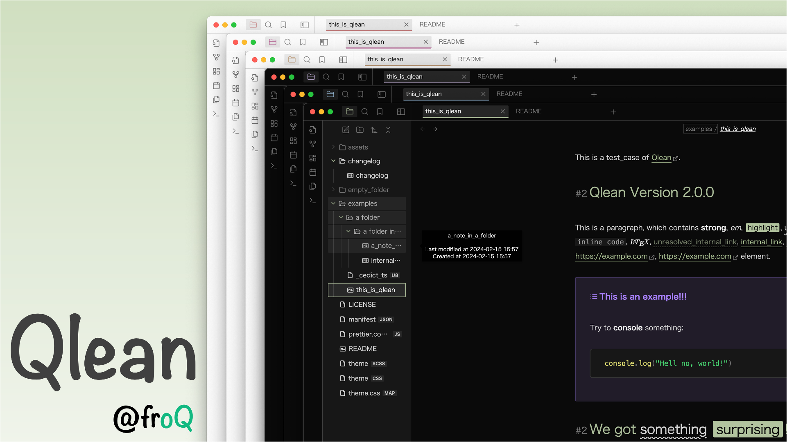
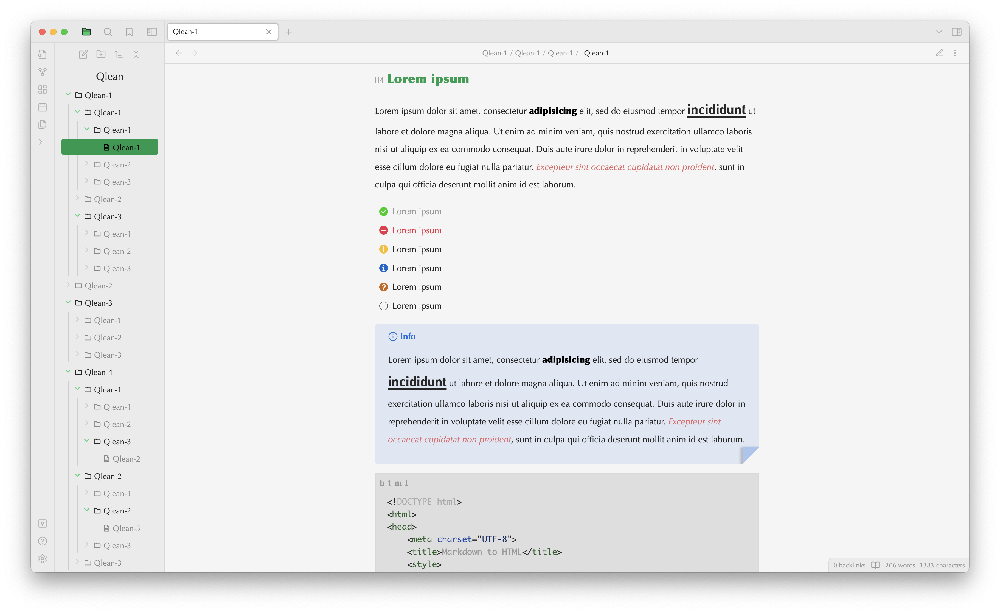
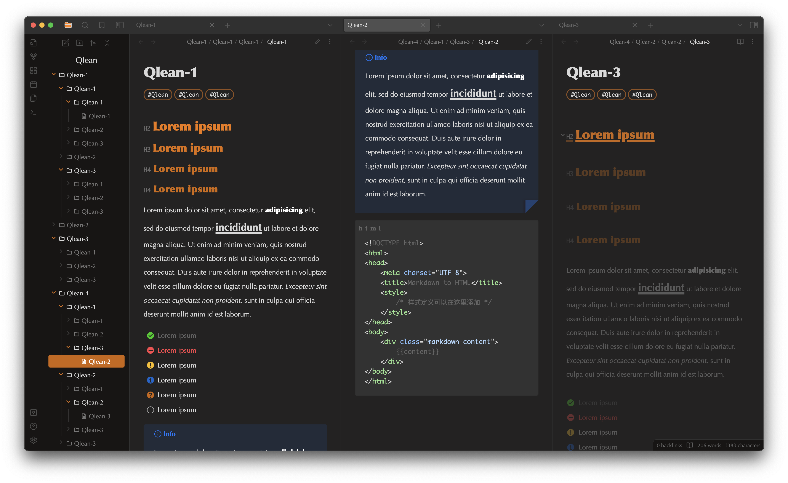

An Obsidian theme offers a clean and clutter-free interface for enhanced focus and productivity.

---

## Updates

### Version 0.1.1

#### change

1. Background color of active file in file tree is no longer dark(changed to accent color);
2. Selected text color now works as accent color;

#### bug fix

1. Left-top corner color correctly works in Zen mode;

## Screenshots

## Features

Qlean builds upon the default theme. At first glance, it may not seem much different. However, it offers several features hoped to enhance the user experience and provide a more customizable interface.

1. Accent Colors Separated by Themes: I abondoned the default accent color selector and instead offer separate accent color options for both light and dark themes.
2. Enhanced File Tree: The left-side file tree displays now descendants and ancestors.
3. Checkbox Icons: Offers extra filling options (-, !, ?, i) to create different checkbox icons within `- []`.
4. Focus and Zen Modes: The focus mode reduces the opacity of non-active lines, while the zen mode hides the tab and left icon areas, leaving only the editor for a clutter-free interface(However zen mode is kind of buggy).
5. Customizable Styles: **Strong**, _Em_, ==Highlight==, and <u>underline</u> styles are highly customizable, enabling users to add a personal touch to their notes.

## TODO

1. Fix bugs;
2. Mobile-available;
3. UI and inline elements design;
4. Expand checkbox icons;
5. ...

## Upcoming Plugin

I am currently working on a plugin that will enable a **visual** checkbox selection interface.(Currently, clicking checkboxes only fills them as `- [x]`.)
  
## How did it start?

Qlean is inspired by the word "Clean". Frustrated with the lack of certain features and styles in other themes, I decided to create my own.

> At first, I planned to modify existing community themes to meet my needs. However, my interest in CSS grew rapidly (I had little knowledge of CSS, HTML, and JS before), and I ended up designing a completely new theme from scratch.

Qlean is still a work in progress and may have some bugs due to limitations of my skills and knowledge. So don't hesitate to provide feedback and report issues. I will try my best to address them as soon as possible.

Open to suggestions and expectations!

## Contact Moi

Email: qingzhengye@outlook.com
GitHub: [@Fro-Q](https://github.com/Fro-Q)

## License

This theme is licensed under the MIT License.
