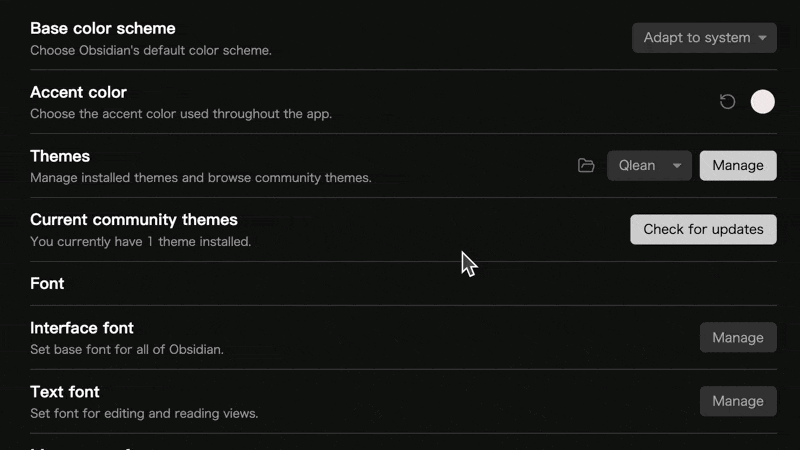
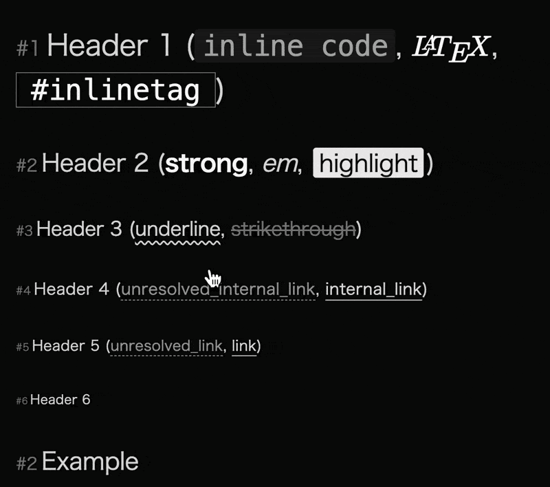

> ~~"An Obsidian theme offers a clean and clutter-free interface for enhanced focus and productivity."
> Generated by GitHub Copilot.~~

No Intro.

## Features

> [!hint]
> In order to get the best experience, it is recommended to use "Style Settings" plugin to customize the theme.

### Accent Color

1. We (Actually I) offer the options that allow users to set accent color **separated by color scheme**, in which case you need to use options offered in "Style Settings" to set the accent color for light and dark themes separately.
2. Also, we offer the option that allows users to use the built-in color picker.

> [!caution]
> However, the built-in color picker will still influence the **text color** in **buttons that have a accent color background** (let's call them **accent buttons** for now) even if you don't turn on the `Use built-in color picker` option. So in this case, if you choose a dark color in the built-in color picker, the text color in accent buttons will be white, no matter what accent color you set in "Style Settings", and may make the text unreadable.
>
> We add a **hover style** for accent buttons to make them more readable. We know it's not a perfect solution, but it's the best we can do for now.

### Redesigned Styles

1. **Header Level Indicators**: With this feature enabled, the header collapes indicators will not be shown. Clicking on the level indicator will collapse or expand the header.

2. We offer a bunch of options to **customize inline style**s, including **strong**, _em_, ==highlight==, <u>underline</u> and more.
3. Users now can change the **font family** separately for the different parts of the App, including text, headers, monospace, UI, file tree, vault name, and source code view.
4. **Checkbox Icons**: Offers extra filling options (`-`, `!`, `?`, `i`, `x`) to create different checkbox icons within `- [ ]`.

### File Tree

1. **Ancestors and Descendants Indicators**: With these indicators, users can easily see the ancestors and descendants of the active file or hovered file.

### Focus and Zen Modes

1. The focus mode **reduces the opacity of inactive lines**, and the Zen mode hides the tab and ribbon, leaving **only the edito**r for a clutter-free interface.

### More to Explore

1. Two tag style - fill and outline.
2. Alt of embed.
3. Redesigned buttons and inputs.
4. Redesigned code block. (I bet you will love it.)
5. ...

> [!caution]
> Developed and tested on macOS. May not work as expected on other platforms.

> [!hint]
> Features introduction ends here. If you don't want to read my nagging, you can stop here.

---

## How did it start?

### About the name

Qlean is inspired by the word "Clean", and "Q" is the initial letter of my last name.

### Why did I start?

At first, I planned to modify existing community themes to meet my needs. But as I went deeper, I found that writing CSS is kind of fun. So I decided to create a theme from scratch.

### What's the goal?

Qlean is still a work in progress and may have some bugs due to limitations of my skills and knowledge. So don't hesitate to provide feedback and report issues. I will try my best to address them as soon as possible.

Open to suggestions and expectations!

## Contact Moi

Email: qingzhengye@outlook.com
GitHub: [@Fro-Q](https://github.com/Fro-Q)

Also, you can visit my [blog](https://fro-blo.com/) to see more about me. (Currently, blogs are written in only Chinese.)

## License

This theme is licensed under the MIT License.
