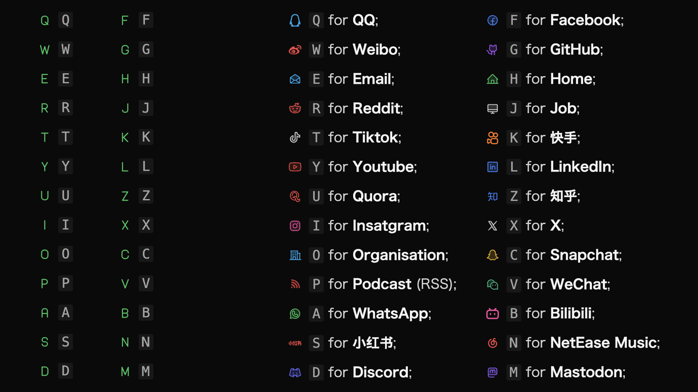

> "An Obsidian theme surprising you."
> Generated by me

No Intro.

For full changelog, check <https://github.com/Fro-Q/Qlean/blob/main/changelog/changelog.md>.

If you are making a PR, please modify the `theme.scss` file and generate a `style.css` based on it. Please ==DO NOT== modify the `style.css` directly because it may cause troubles for updating the theme.

## Features

> [!hint]
> To get the best experience, it is recommended to use "[Style Settings](obsidian://show-plugin?id=obsidian-style-settings)" plugin to customize the theme.

### File Tree

1. **Ancestors and Descendants Indicators**: With these indicators, you can easily see the ancestors and descendants of the active file or hovered file.
   
2. **Outline**: Outline also has the ancestors and descendants indicators.
3. **File icons**: More file icons are coming.

### Accent Color

1. **Accent color separated by color scheme**: You can choose different accent colors for light and dark schemes.
2. **Fully customizable**: With HSL color picker, you can customize the accent color as you like.

### Redesigned Styles

1. **Header Level Indicators**: With this feature enabled, the header collapes indicators will not be shown. Clicking on the level indicator will collapse or expand the header.
   
2. **Highly customizable inline el**: **strong**, _em_, ==highlight==, ~~strikethrough~~, <u>underline</u> and more elements can be customized, including color, weight, font-style, and decorations.
3. **Redesigned buttons and toggles**: This one should be quite surprising, since we have a brand new style for toggles as below!
   
4. **Glassmorphism panels**: The glassmorphism effect can be applied to the modals and popups.
   

### Prettier Tables

1. **More readable table**: Vertically centered text, option to toggle if the header is always aligned in the center, drag handles' visibility when hovering on the cell, and more.
   
2. **Full width table**: With this feature enabled, the table's width will be 100% of the container instead of fitting the content.

### CHECKBOX STYLE!!!

1. **Use your own checkbox style**: Thank to [@damiankorcz](https://github.com/damiankorcz) for the implementation. Read more about this initiative in this repo: [Alternative-Checkboxes-Reference-Set](https://github.com/damiankorcz/Alternative-Checkboxes-Reference-Set).
2. **For all letters, numbers and some special characters**: Now you got different styles for all 26 letters, **in both lower and upper case**, numbers from 0 to 9, and some special characters like `!`, `@`, `#`, `%`, `&`, `*`, `-`, `+`, `?`, `ø`, `¶`, `$`, `€`, `£`, `¥`, `₿`, `Ξ`, `_`, `"`, `…`, `>`, `[`, `{`, `(`, `/`.
   
3. **Upper case**: There are two sets to choose from, one is simply the upper letter itself, and the other is social media set.
   

### Other Features

1. **Focus and Zen Modes**;
2. **Header color**, **Header hovering underline**;
3. **Code block language indicator**;
4. **Better "Copy" button style in codeblock**;
5. **Tag Style**;
6. **Alt of embed**;
7. Coming soon...

### More to Explore

- [x] Two tag style - fill and outline.
- [x] Alt of embed.
- [x] Redesigned buttons and inputs.
- [ ] More to come...

> [!caution]
> Developed and fully tested on macOS, and partially tested on Windows, PadOS. Due to the limitation of my devices, working perfectly on other platforms is not guaranteed. If you find any bugs or have any suggestions, please feel free to contact me.

> [!hint]
> Features introduction ends here. If you don't want to read my nagging, you can stop here.

## Known Issues

1. DON'T Edit tables in source code mode. In order to prevent horizontal scrolling, the max-width of the table is set to 100% even when in source code mode, which means they can be incredibly unreadable.
2. In edit mode, contents in code block will wrap to the next line if they are too long. This is a result of Obsidian's default behavior and cannot be changed by CSS. In preview mode, they will not wrap and produce a horizontal scrollbar instead.

---

## How did it start?

### About the name

Qlean is inspired by the word "Clean", and "Q" is the initial letter of my last name.

### Why did I start?

At first, I planned to modify existing community themes to meet my needs. But as I went deeper, I found that writing CSS is kind of fun. So I decided to create a theme from scratch.

### What's the goal?

Qlean is still a work in progress and may have some bugs due to limitations of my skills and knowledge. So don't hesitate to provide feedback and report issues. I will try my best to address them as soon as possible.

Open to suggestions and expectations!

## Contact Moi

Email: froqqq@outlook.com
GitHub: [@Fro-Q](https://github.com/Fro-Q)

https://example.com
Also, you can visit my [blog](https://fro-blo.com/) to see more about me. (Currently, blogs are written in only Chinese.)

Your sponsorship can help me sustain my projects more actively. Consider Sponsoring me on [爱发电](https://afdian.net/a/fro-q) or Alipay.

## License

This theme is licensed under the MIT License.
